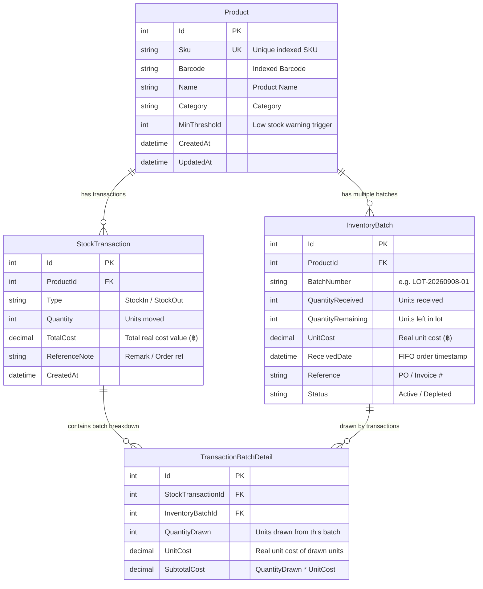

# StockPulse: Project Proposal & Technical Blueprint
> **Real-Cost Inventory & Stock Accounting Management System (ระบบจัดการสต็อกและต้นทุนสินค้าจริงตามมาตรฐานบัญชี)**

---

## 1. Executive Summary & Vision

**StockPulse** is a modern, responsive, full-stack inventory and cost management platform engineered for businesses, e-commerce merchants, and accounting departments. Unlike conventional inventory software that uses simplistic moving average costs, StockPulse strictly adopts the **FIFO (First-In, First-Out / ราคาทุนจริงรายรอบ)** accounting standard.

The platform tracks every inbound stock shipment as an independent **Lot/Batch** with its actual purchase price (**ราคาต้นทุนจริง**). When inventory is dispatched or sold, the FIFO cost allocation engine automatically draws units from the oldest active lots first, accurately reporting:
1. **ต้นทุนที่เหลือกี่ชิ้นและเป็นจำนวนเงินเท่าไหร่**: Remaining Quantity on Hand & Exact Ending Inventory Valuation ($\sum \text{Batch.RemainingQty} \times \text{Batch.RealUnitCost}$).
2. **ต้นทุนว่าออกไปเท่าไหร่และกี่ชิ้น**: Total Outbound Units & Cost of Goods Sold (COGS) based on actual receipt costs.

Designed as a **Quick-Win** system with zero external database dependencies (self-contained SQLite), StockPulse is ready for production scaling, automated machine hardware scanners, and future cloud/DevOps pipelines.

---

## 2. Problem Statement & Accounting Rationale

### The Pitfall of Moving Average Costing
In many businesses, the purchase cost of raw materials and wholesale goods fluctuates between shipments (e.g., Batch #1 purchased at ฿5/unit, Batch #2 purchased at ฿10/unit). 
- Using an **Average Cost** distorts official accounting books, inventory tax valuation, and gross profit margins.
- Bookkeepers and auditors require **Specific Lot Tracking** and **FIFO Audit Trails** to trace exactly which receipt lot contributed to each outbound transaction.

### The StockPulse Solution: FIFO Real-Cost Allocation
When **Product A** is purchased in two batches:
- **Batch #1**: 10 units @ ฿5.00 (Total ฿50.00)
- **Batch #2**: 5 units @ ฿10.00 (Total ฿50.00)
- **Current Inventory**: 15 units worth **฿100.00**

When **12 units** are stocked out:
1. **10 units** are drawn from **Batch #1** @ ฿5.00 = ฿50.00 (Batch #1 marked as `Depleted`).
2. **2 units** are drawn from **Batch #2** @ ฿10.00 = ฿20.00 (Batch #2 has 3 units remaining).
3. **Instant Financial Results**:
   - 📤 **Cost of Goods Out (COGS)**: 12 units = **฿70.00** (with transparent batch breakdown).
   - 📦 **Ending Stock Remaining**: 3 units = **฿30.00** (@ ฿10.00 in Batch #2).

---

## 3. System Architecture & Tech Stack

```
stock-inventory/
├── backend/                         # ASP.NET Core Minimal API (.NET 10)
│   ├── Data/
│   │   ├── AppDbContext.cs          # EF Core DbContext with Enum-as-String mappings
│   │   └── DbInitializer.cs         # Realistic seed data (Sample FIFO products & lots)
│   ├── Endpoints/                   # Modular Minimal API Route Groups
│   │   ├── ProductEndpoints.cs      # /api/products (CRUD, Scanner Lookup, Batches)
│   │   ├── StockEndpoints.cs        # /api/stock (Stock In, Stock Out, Live Preview)
│   │   ├── TransactionEndpoints.cs  # /api/transactions (Audit trail log)
│   │   └── DashboardEndpoints.cs    # /api/dashboard (Executive KPIs & Flow trends)
│   ├── Models/                      # Entities (Product, InventoryBatch, StockTransaction, etc.)
│   ├── Services/                    # FIFO Costing Engine & Scanner Resolver
│   └── Program.cs                   # Minimal API Host, CORS, SQLite
│
├── frontend/                        # Next.js 15+ (App Router, React 19, TypeScript)
│   ├── src/
│   │   ├── app/                     # Page, Layout, Global CSS
│   │   ├── components/
│   │   │   ├── Dashboard/           # Hero KPI Cards, Movement Flow Chart, Top Valued Items
│   │   │   ├── Products/            # Filterable Table, ProductModal, BatchesModal, MovementModal
│   │   │   ├── Transactions/        # Full Transaction Journal & CSV Exporter
│   │   │   ├── Scanner/             # Global Barcode Gun Listener & Quick Scanner View
│   │   │   └── Navbar.tsx, Sidebar.tsx, MobileNav.tsx
│   │   ├── lib/api.ts               # Type-safe API client & Thai Baht formatters
│   │   └── types/index.ts           # Shared TypeScript interfaces
│   └── package.json
└── README.md
```

### Technology Highlights
- **Backend**: **.NET 10 Minimal APIs** (C# 13)
  - Ultra-fast endpoint mapping with `app.MapGroup("/api/...")`.
  - Entity Framework Core with SQLite (`stock.db`) for zero-configuration, persistent local storage.
  - C# Enums (`TransactionType.StockIn/StockOut`, `BatchStatus.Active/Depleted`) persisted as readable strings via `.HasConversion<string>()`.
- **Frontend**: **Next.js 15+ (App Router)** & **React 19**
  - **Tailwind CSS** for clean, responsive UI on Desktop, Tablet, and Mobile.
  - **Lucide Icons** for intuitive visual cues.
  - **Zero-lag pure CSS/SVG visual charts** for daily stock flow.

---

## 4. Key Capabilities & User Experience

### 1. Dual-Input Mode for SKU (Manual Human Typing & Machine Scanners)
- **Manual Input**: Type SKU or Product Name with live auto-complete and search filters.
- **Machine Scanner Integration**: 
  - Standard USB/Bluetooth barcode guns and RFID scanners emit rapid HID keystrokes terminated by `Enter`.
  - The built-in **Global Scanner Listener** detects this signature from anywhere on the page, automatically resolving the product and opening the Stock Movement modal without requiring mouse clicks.
- **Machine-to-Machine REST API**: External sorting machines, robotic arms, or third-party POS systems can directly call `/api/products/lookup/{code}` or `/api/stock/out`.

### 2. Live FIFO Preview on Stock Out
Before confirming any outbound movement, the system provides a real-time **Cost Breakdown Preview**, notifying the user:
> *"Deducting 10 units from Lot LOT-20260901-01 @ ฿5.00 (฿50.00)*  
> *Deducting 2 units from Lot LOT-20260905-02 @ ฿10.00 (฿20.00)*  
> *Total Outbound Cost Impact: ฿70.00"*

### 3. Safety Safeguards & Typo Protection
- **SKU Typo Correction**: SKU codes can be edited if mistyped. All historical batches and transactions remain intact via immutable internal database keys (`ProductId`).
- **Uniqueness & Sanitization**: Strict regex checks (`^[A-Za-z0-9_-]{2,50}$`) prevent special characters that break barcode scanners or machine sorters.
- **Low Stock Alerts**: Configurable `MinThreshold` per product with prominent visual badges:
  - 🟢 **In Stock** (Stock > Threshold)
  - 🟡 **Low Stock** (0 < Stock $\le$ Threshold)
  - 🔴 **Out of Stock** (Stock = 0)

### 4. Accounting Audit Journal & Export
- Complete chronological transaction ledger detailing exact lots consumed.
- **Export to CSV** button generating UTF-8 formatted spreadsheets compatible with Microsoft Excel and ERP accounting software.

---

## 5. Database Schema & Data Models



---

## 6. API Specification

| Method | Endpoint | Description |
| :--- | :--- | :--- |
| `GET` | `/api/dashboard/summary` | Executive KPI stats (Units, Valuations, COGS, Trends, Alerts) |
| `GET` | `/api/products` | Filterable list (`search`, `category`, `status`) |
| `GET` | `/api/products/{id}` | Single product with active batches |
| `GET` | `/api/products/lookup/{code}` | Fast machine lookup matching SKU or Barcode |
| `GET` | `/api/products/{id}/batches` | All active and historical batches for a product |
| `POST` | `/api/products` | Create product with optional initial stock batch |
| `PUT` | `/api/products/{id}` | Update product details (SKU typo, Name, Category, MinThreshold) |
| `DELETE`| `/api/products/{id}` | Remove product |
| `POST` | `/api/stock/in` | Receive new stock batch with real purchase cost |
| `POST` | `/api/stock/preview-out`| Simulate FIFO batch deductions and preview cost out |
| `POST` | `/api/stock/out` | Execute stock deduction using FIFO allocation |
| `GET` | `/api/transactions` | Full audit log with batch details and date filters |

---

## 7. Getting Started & Running Locally

### Prerequisites
- [.NET 10 SDK](https://dotnet.microsoft.com/download)
- [Node.js](https://nodejs.org/) (v18+) & `npm`

### Step 1: Start the Backend (.NET 10 Minimal API)
```bash
cd backend
dotnet run
```
*The API will start listening on `http://localhost:5200` with auto-created SQLite database `stock.db` pre-seeded with sample data.*

### Step 2: Start the Frontend (Next.js 15)
```bash
cd frontend
npm install
npm run dev
```
*The web interface will be available at `http://localhost:3000`.*

---

## 8. Future Roadmap & DevOps Readiness
While Version 1 prioritizes rapid deployment (Quick-Win) and zero-config local operations:
- **Phase 2 (DevOps & CI/CD)**: Multi-stage `Dockerfile` and GitHub Actions workflows for automated build, testing, and deployment.
- **Phase 3 (Enterprise Database)**: Seamless 1-line configuration migration from SQLite to PostgreSQL or Microsoft SQL Server via EF Core.
- **Phase 4 (Hardware Terminal PWA)**: Progressive Web App support with offline caching and native camera barcode scanning for mobile warehouse workers.
